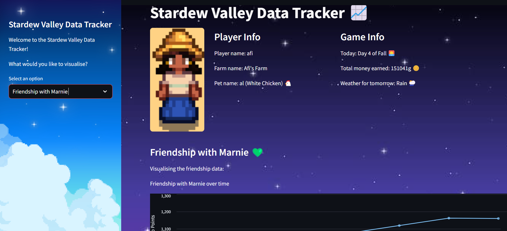

# Stardew Valley Data Tracker 


Stardew Valley is a popular indie role-playing game (designed by Eric Barone) where players inherit an old farm plot and begin life in a new place called 'Stardew Valley'. The purpose of this project is to track player's stats over time, such as experience points and earnings, to allow them to strategise or even just satisfy their curiosity about how they've been doing so far. 

## Project Structure 

```
stardew_data/ 
├── .streamlit/ # Streamlit configuration folder  
|   └── config.toml # Streamlit theme 
├── Afis_346896825/
|   ├── Afis_346896825 # Most up to date save file
|   ├── Afis_346896825_old
|   ├── SaveGameInfo
|   └── SaveGameInfo_old
├── static/ # Folder for static assets (images) 
|   ├── afi.png # Player image
|   ├── bg.jpg # Background image
|   ├── game.jpg # Game start screen
|   └── website_preview.png # Streamlit app preview
├── .gitignore
├── app.py # Streamlit app for visualising the data 
├── extract.py # Script for extracting data from the save file 
├── index.py # Runs above script every time save file is updated
├── README.md # Project documentation 
└── requirements.txt # Python dependencies  
```

## ETL pipeline

* The data was extracted from the save file after each in-game day using an XML parser - `xml.etree.ElementTree` - in Python. (Using `watchdog` to detect when the save file was modified in order to trigger the extraction process.)
* All columns (except for the primary key and the `talked_to_today` column) were then transformed to integers.
* The data was then loaded into a Postgres database using the `sqlalchemy` package.

## Streamlit app

* The app allows you to select certain variables to visualise over the in-game days for which data was collected. For example, it allows you to track earnings over the week. This was done for my most recent save file just to demonstrate, but can be easily replicated for other players by changing the `FILEPATH` variable in the extract.py and index.py scripts to their own save file. They can then decide which database/location they want to store their data in and change the `DATABASE_URL` variable accordingly.
* The tooltip shows other variables which may have had an impact on the y-axis for each chart. For example, when visualising money earned, one can see the cumulative number of 'crops shipped' (sold) for each data point.

The app is accessible below:

[](https://stardewdatatracker.streamlit.app)

## **Extraction Script Instructions**

Things to note after forking and cloning this repo:
* Your `.env` file should contain variables `FILEPATH` (path to your save file), `DATABASE_URL` (database connection) and `FILENAME` (name of your save file). If deciding to deploy a Streamlit app rather than running it locally, you must additionally place these variables in a `secrets.toml` file and access them that way.
* The `extract.py` file should be edited to include the correct schema name for your database table.
* Place a screenshot of your character in the static folder - you can either give it the name `afi.png` or replace this name in `app.py`.

1. To install dependencies, run the following in a terminal:
   ```bash
   pip install -r requirements.txt
   ```
2. To deploy the ETL pipeline, given that you have the correct variables in your `.env` file, run:

   ```bash
   python index.py
   ```
   and simply begin playing.