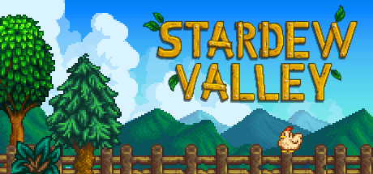

# Stardew Valley Data Tracker 



Stardew Valley is a popular indie role-playing game (designed by Eric Barone) where players inherit an old farm plot and begin life in a new town called 'Stardew Valley'. The purpose of this project is to track player's stats over time, such as experience points and earnings.

## Project Structure 

```
stardew_data/ 
├── .streamlit/ # Streamlit configuration folder  
|   └── config.toml # Streamlit theme 
├── Afis_346896825/
|   ├── Afis_346896825 # most up to date save file
|   ├── Afis_346896825_old
|   ├── SaveGameInfo
|   └── SaveGameInfo_old
├── static/ # Folder for static assets (images) 
|   ├── afi.png # Player image
|   ├── bg.jpg # Background image
|   └── game.jpg # Game start screen
├── .gitignore
├── README.md # Project documentation 
├── app.py # Streamlit app for visualising the data 
├── extract.py # Script for extracting data from the save file 
└── requirements.txt # Python dependencies  
```

## ETL pipeline

The data was extracted from the save file after each in-game day using an XML parser - `xml.etree.ElementTree` - in Python.
All columns (except for the primary key) were then transformed to integers before being loaded into a Postgres database using `sqlalchemy`.

## Streamlit app

The app allows you to select certain variables to visualise over the in-game days for which data was collected. For example, it allows you to track earnings over the week. This was done for my most recent save file but can be easily replicated for other players by changing the `FILEPATH` variable in the extraction script to their own save file. They can then decide which database/location they want to store their data in and change the `DATABASE_URL` variable accordingly.

[stardewdatatracker]('https://stardewdatatracker.streamlit.app')